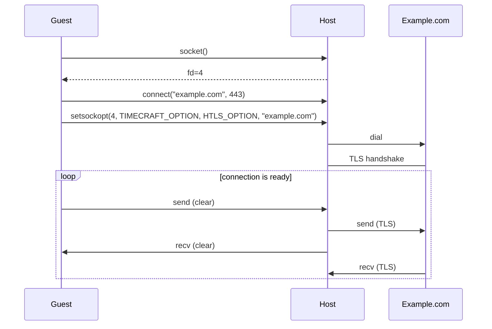

# Host TLS offload

Timecraft provides host TLS offload (hTLS). After a socket is open, timecraft
can be instructed to wrap it in a TLS tunnel. Once it is, reads and writes on
the socket are transparently encrypted and decrypted. It allows the WebAssembly
guest to delegate offload TLS operations to the host. This has multiple
advantages over performing encryption in the guest:

* it reduces the code complexity of the guest,
* significantly increases performance (cryptography operations can be
  prohibitively expensive in WebAssembly at the moment),
* makes all built-in Timeceraft [network and syscall tracing][tracing]
  features work seamlessly with no additional configuration.

At the moment, only client-side TLS is supported, with no configuration
abilities. Server-side and further configuration options will be supported as
needed. [Send a pull request!][htls-code]

[htls-code]: https://github.com/stealthrocket/timecraft
[tracing]: /using-timecraft/execution-tracing.md

At a very high level, hTLS works by setting a special option on a socket. How
to set that option is described in the [Usage](#usage) section below. Socket
options have a level and an option name. In this document we use the following
constants to refer to them:

* `TIMECRAFT_LEVEL = 0x74696d65`: the socket level of the socket option.
* `HTLS_OPTION = 1`: the name of the hTLS option.

## Usage

After opening a socket, use the `sock_setsockopt` host function to set the
option `HTLS_OPTION` of level `TIMECRAFT_LEVEL` to the hostname to connect to.

### Go

When importing the [Timecraft Go SDK][go-sdk], the `net/http.DefaultTransport`
is automatically modified to take advantage of hTLS. As a result, the standard
library default HTTP client can be used directly without extra step:

```go
import "net/http"

// will do hTLS to example.com behind the scenes
http.Client.Get("https://example.com")
```

Alternatively, the dial function `timecraft.DialTLS` that can be used to
establish a `net.Conn` with hTLS enabled. For example:

```go
conn, err := timecraft.DialTLS(context.Background(), "tcp", "example.com:443")
if err != nil {
	// handle error
}
// conn is a net.Conn
fmt.Fprintf(conn, "GET / HTTP/1.0\r\n\r\n")
```

[go-sdk]: https://github.com/stealthrocket/timecraft/tree/main/sdk/go/timecraft

### Python

When using [Timecraft CPython distribution][python], the built-in `ssl` module
will perform hTLS automatically. As a result, most libraries will use it out of
the box. For example with the popular [requests][requests] HTTP library:

```python
import requests

# does hTLS to example.com behind the scenes
requests.get("https://example.com")
```

If you want to use `ssl` yourself, create an `SSLContext` and use `wrap_socket`
on an existing socket. For example:

```python
import socket
import ssl

hostname = 'example.com'
context = ssl.create_default_context()

buf = bytearray(1024)
view = memoryview(buf)

with socket.create_connection((hostname, 443)) as sock:
    with context.wrap_socket(sock, server_hostname=hostname) as ssock:
        b = ssock.sendall(b"GET / HTTP/1.1\r\nHost: example.com:443\r\n\r\n")
        nbytes = ssock.recv_into(view, 1024)
        print(buf[:nbytes])
```

[python]: /getting-started/prep-application/compiling-python.md
[requests]: https://requests.readthedocs.io/en/latest/

### C

Using [wasi-libc][libc], use `setsockopt` on an existing socket, before
performing a send/recv operation. For example:

```c

struct addrinfo hints, *res;
memset(&hints, 0, sizeof(hints));
hints.ai_family = AF_UNSPEC;
hints.ai_socktype = SOCK_STREAM;
getaddrinfo("example.com", "443", &hints, &res);

int sock = socket(res->ai_family, res->ai_socktype, res->ai_protocol);
connect(sock, res->ai_addr, res->ai_addrlen);
setsockopt(sock, TIMECRAFT_LEVEL, HTLS_OPTION, "example.com", sizeof("example.com"));

// send/recv...
```

[libc]: https://github.com/stealthrocket/wasi-libc/tree/d704f269682cc75da51de94166b79a39e3fe42b4

### Other

1. Create a socket with the WASM host function socket
   `wasi_snapshot_preview1.sock_open`.
2. Connect the socket with WASM host function socket
   `wasi_snapshot_preview1.sock_connect`.
3. Set the option `HTLS_OPTION` of level `TIMECRAFT_LEVEL` to the hostname of
   the server using `wasi_snapshot_preview1.sock_setsockopt`.
4. Use the socket knowing hTLS is enabled.

## How it works

hTLS works similarly to [Kernel TLS (kTLS)][ktls]. First a socket is created,
then a socket option is used to indicate to the host that it should enable hTLS.
A couple significant differences with kTLS:

* The socket option can be performed after the socket is connected, but not
  after the first `recv`/`send`/`poll` operation.
* The host performs the handshake and certificate validation.

When the socket is connected, the host performs the TLS handshake immediately.
In non-blocking mode, polling the socket returns `EINPROGRESS` until the
handshake has completed or errored.

Timecraft uses Go's TLS stack to implement hTLS. The main implication is that
certificate validation is performed using the default certificates available to
the host Go runtime, and all behaviors follow Go's built-in `crypto/tls` module.


[ktls]: https://docs.kernel.org/networking/tls-offload.html



